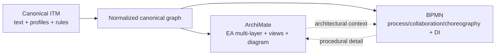
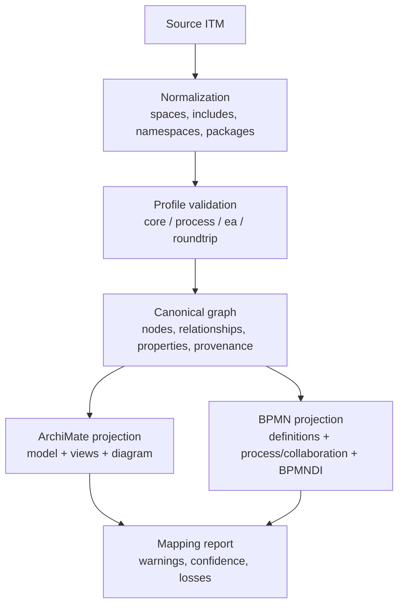

# Rigorous comparison between ITM, ArchiMate, and BPMN

## Executive summary

The ITM described in the uploaded file is not merely “indented text”: it is a progressive format that starts from a list of lines and evolves into a true textual modeling language with stable IDs, typed relationships, structured attributes, namespaces, types, validation rules, plugins, viewpoints, views, overlays, packages, and repositories. This makes it potentially suitable as a canonical authoring format and as an intermediate transformation layer, but only if the file actually uses these richer levels; an ITM limited to indentation-only lines remains too poor for a faithful round-trip to ArchiMate or BPMN. fileciteturn5file6 fileciteturn5file8 fileciteturn5file5 fileciteturn5file7

ArchiMate and BPMN do not solve the same problem. BPMN 2.0.2 is a formal OMG standard intended for process diagrams that are usable by stakeholders yet precise enough to be translated into software components; the specification also includes machine-readable normative documents, with a strong emphasis on behavior, conformance, diagram interchange, collaboration, and choreography. ArchiMate, in the official The Open Group sources consulted, is instead an open and independent language for enterprise architecture, aimed at describing, analyzing, and visualizing the relationships between architectural domains in an unambiguous way; its XML exchange format is standardized, and the corresponding model exchange capability is required for certified tools. citeturn24view0turn6view0turn37search10turn33search11turn18search11turn33search15

The practical consequence is clear. **ITM → BPMN** is strongest when the ITM uses an explicit process profile and materializes activities, events, gateways, participants/lanes, sequence flows, message flows, and data. **ITM → ArchiMate** is strongest when the ITM uses an explicit EA profile and materializes actors, roles, processes, services, components, data objects, and ArchiMate relationships. The reverse transformations are possible, but they require ITM to serialize a **graph**, not only a **tree**; otherwise, from BPMN one quickly loses execution semantics, boundary events, choreography/conversation, and DI layout, while from ArchiMate one loses the plurality of views, the distinction between organization and semantic relationships, and the richness of the multi-layer metamodel. fileciteturn5file3 fileciteturn5file2 citeturn43view0turn43view1turn43view3turn49search0turn46search1turn47search0

The most important point, in the end, is this: **it is not advisable to transform directly from “ITM text → BPMN XML” or “ITM text → ArchiMate XML”**. The better route is **ITM → normalized canonical graph → target projection**. This matches both the structure of the ITM file, which defines deterministic phases for parsing, normalization, implicit relationship inference, validation, viewpoints, views, and write-back, and the attached research, which recommends a neutral semantic model with external IDs, relationships, a property bag, cross-references, and validation issues separated from mapping code. fileciteturn5file7 fileciteturn5file2

## Method and normative sources

For ITM I used the uploaded file `indented_text_model_format_description_updated.md` as the primary source, supplemented by the attached Italian research. For BPMN I used the official OMG page for version 2.0.2 and the normative 2.0.2 PDF, which also lists the related CMOF/XSD artifacts; for ArchiMate I used publicly available official The Open Group sources: the language overview, the 3.2 reference cards, and the public XSD documentation for model exchange, views, and diagram interchange. The public normative sources consulted for ArchiMate and BPMN are in English; the attached research, by contrast, is in Italian and I used it as a primary support source already contextualized in the requested language. fileciteturn5file3 fileciteturn5file5 citeturn24view0turn6view0turn37search10turn39search5turn1search1turn10search0turn49search0turn46search0

For ArchiMate there is a methodologically important distinction between **language** and **exchange format**. The 3.2 reference cards are used here for the language concepts and the definitions of elements/relationships; the public 3.1 XSD documentation is instead used for details of the exchange format, views, and diagram layer. This is sufficient for a serious comparison of “language + metamodel + exchange format”, which is what is needed for automatic transformation to and from ITM. citeturn1search1turn39search5turn14search0turn45search0turn49search0turn46search1turn47search0

The comparative analysis follows five distinct planes. The first is the **syntactic surface**. The second is the **metamodel semantics**. The third is the **exchange format**. The fourth is the handling of **views, viewpoints, and layout**. The fifth is the presence or absence of **execution semantics**, standard extensions, and round-trip metadata. This separation is essential, because a mapping that appears plausible syntactically often fails when relationships, constraints, or layout are considered. fileciteturn5file2 citeturn24view0turn18search11turn49search0turn51view3

## ITM as a format, syntax layer, and profile mechanism

In the uploaded document, ITM is explicitly progressive. The minimum level is “one line = one entity”; then come tags, indentation, automatic relationships, IDs, links, typed links, Markdown descriptions, attributes, directives, metadata, includes, namespaces, types, selectors, rules, plugins, styles, viewpoints, views, visual editing, overlays, packages, and repositories. In other words: ITM is not born as a textual clone of ArchiMate or BPMN, but as an **incremental modeling container** that can become rich enough to project itself toward several specialist notations. fileciteturn5file9 fileciteturn5file6

At the syntactic level, the essential points are very clear. Canonical indentation is two spaces; children generate a hierarchy, from which the processor can derive implicit containment relationships and, if required, ordering relationships between siblings. IDs are declared with `&id`; links use `@target` or `@type:target`; namespaces use `::`; node and relationship attributes are in brace-delimited blocks with YAML-compatible syntax; textual descriptions use lines beginning with `|`; file-level constructs use directives beginning with `%`. This means that ITM, while remaining readable as text, can clearly distinguish identity, type, relationship, metadata, and documentation. fileciteturn5file6 fileciteturn5file8 fileciteturn5file5

At the semantic level, ITM already has the building blocks needed for a serious transformation. The specification defines `%entitytype`, `%relationshiptype`, `%rule`, `%style`, `%viewpoint`, `%view`, `%require`, `%package`, `%using`, and `%repository`, as well as a deterministic processing model that parses directives, resolves repositories and includes, activates packages and namespaces, parses entities/relationships, generates implicit relationships, applies overlays, performs validation, handles viewpoints, views, and controlled write-back. This is much closer to a **textual modeling framework** than to a simple outline. fileciteturn5file5 fileciteturn5file7

The question about **standardized profiles** nevertheless requires a cautious answer. In the uploaded text, ITM **supports** profiles embedded in the file through packages, namespaces, and `%using`, and it shows concrete examples such as `bpmn_profile` and `architecture_profile`; however, the document does not contain a **normative catalog of standardized profiles** with canonical identifiers, official versioning, and mandatory constraints comparable to an external specification. In other words: the profiling mechanism is present and already useful, but the examples appear to be **illustrative and design-oriented**, not a closed normative registry. This matters greatly for mappings, because without an explicit profile the converter is forced to infer. fileciteturn5file5 fileciteturn5file8 fileciteturn5file2

A minimal example from the specification makes the point immediately:

```itm
%package bpmn_profile
{
  version: 0.1.0
  namespace: bpmn
  description: Basic BPMN semantic profile for ITM.
}

%using bpmn_profile.types
%using bpmn_profile.rules
%using bpmn_profile.styles
```

This fragment shows that ITM can embed not only model data in the file, but also **activation of a semantic profile** and the related constraints, styles, and viewpoints. This is exactly the kind of information that makes a mapping less ambiguous. fileciteturn3file1 fileciteturn5file5

## Structural and functional differences between the three formats

The deepest structural difference is the shape of the underlying model. ITM, by construction, starts from a linear and hierarchical textual surface, but the specification allows it to become a graph through explicit references, typing, relationships, overlays, and viewpoints. ArchiMate, by contrast, is natively a **graphical and multi-layer metamodel**, with typed elements and relationships and a model exchange standard that separates content, views, and diagrams. BPMN is also graphical, but its semantics are not generically “relational”: above all, it is a semantics of **flow and execution**, with processes, events, gateways, sequence flows, message flows, collaboration, choreography, and diagram interchange. fileciteturn5file9 citeturn39search5turn14search0turn49search0turn24view0turn26view0turn43view1turn51view3

ArchiMate and BPMN share the fact that they have a standard notation and a standardized exchange format; ITM does not, because its principle is the opposite: the textual model remains canonical, while Mermaid, Graphviz, BPMN XML, BPMN viewers, or ArchiMate renderers are projections or views. This is a huge advantage for versioning, diff, merge, CI/CD, and auditability; but it also means that layout, appearance, and target-specific constraints must either be reconstructed or preserved as peripheral metadata. fileciteturn5file9 fileciteturn5file7 citeturn46search1turn47search0turn51view1turn51view3

On viewpoints and views, ITM and ArchiMate are surprisingly closer to each other than to BPMN. ITM defines `%viewpoint` as a projection pipeline and `%view` as an instance with layout or visibility deltas; the ArchiMate View XSD exposes views with a mandatory `identifier` and optional `viewpoint`/`viewpointRef`, while the diagram layer uses nodes and connections that can reference existing elements and relationships and carry coordinates and dimensions. BPMN, by contrast, has diagram types and BPMNDI, but not the EA concept of a viewpoint as a concern-driven slice of the metamodel. fileciteturn5file5 fileciteturn5file7 citeturn49search0turn48search0turn46search0turn46search1turn47search0turn43view0turn43view3

On execution semantics, BPMN is in a different category. The glossary and conformance sections of the specification define the BPMN process as a graph of flow elements that obeys finite execution semantics; start/end events, parallel or event-based gateways, specialized tasks, and event subprocesses carry concrete behavioral constraints. ArchiMate is not designed as a process execution language in this sense: it is an architectural language. ITM, for its part, does not have native execution semantics normatively defined in the uploaded file; however, it can rely on profiles, rules, and plugins to approach BPMN in process use cases. citeturn6view0turn26view0turn27view0turn8view4turn55view0turn55view1turn55view2turn43view3turn39search5 fileciteturn5file7

The following table summarizes the capabilities that matter most in transformations.

| Capability | ITM | ArchiMate | BPMN | Impact on mapping |
|---|---|---|---|---|
| Diffable textual authoring | native | no | no | exclusive ITM advantage |
| Multi-layer EA metamodel | possible only if profiled | native | no | favors ArchiMate |
| Process and execution semantics | only through profile/plugin | limited and abstract | native | favors BPMN |
| Choreography / Conversation | not native | absent | native | strong loss toward ITM/ArchiMate |
| Motivation / Strategy / Implementation & Migration | only if profiled | native | absent | strong loss toward BPMN |
| Viewpoint as reusable projection | native | native | not equivalent | ITM–ArchiMate affinity |
| Standardized diagram layout | only as metadata/view delta | native in the diagram XSD | native in BPMNDI | partial mapping |
| Package / repository / overlay / plugin | native | not native in the core exchange | not native in core BPMN | exclusive ITM advantage |
| Namespaced extensibility | native | supported in model exchange | supported in BaseElement/XSD | useful for round-trip |
| Rules / diagnostics in the file | native | not native in the core exchange | not native in core semantics | useful for ITM governance |

The overall transformation logic can be visualized as follows:



This schema is consistent with the ITM processing model, with the difference in purpose between ArchiMate and BPMN, and with the literature that treats them as complementary rather than interchangeable. fileciteturn5file7 citeturn38search0turn39search5turn24view0

## Detailed mapping tables and automation feasibility

The following three tables are constructed as follows. The ITM side is based on the uploaded specification, including syntax, packages, profiles, views, and processing model; the ArchiMate side is based on the official language definitions and the public model/view/diagram exchange documentation; the BPMN side is based on the official 2.0.2 specification, the normative PDF, and the related XSD/CMOF artifacts. Where a correspondence is not imposed by the metamodel, I classify it as **partial** or **lossy**, not as 1:1. fileciteturn5file5 fileciteturn5file7 citeturn39search5turn19search0turn31search0turn14search0turn49search0turn46search1turn24view0turn8view2turn43view1turn51view4

**ITM ↔ ArchiMate table**

| ITM construct | Type | ArchiMate construct | Cardinality | Attributes to preserve | Relationships and constraints | Example | Direction and quality |
|---|---|---|---|---|---|---|---|
| `%metadata` + document | document / metadata | `model` + model properties + organization + possible views | 1:n | `title`, `version`, `author`, `defaultNamespace`, profile | ArchiMate separates content, organization, and views; ITM package/repository have no native equivalent | `%metadata {title: Order}` → `<model ...><name>Order</name>` | ITM→ArchiMate: partial; ArchiMate→ITM: partial |
| `%namespace`, `%package`, `%using` | directive / profile | XML namespace + typing + property definitions + optional viewpoints | 1:n / 0:1 | prefixes, profile names, activations | ITM package and repository activation has no standard counterpart in model exchange | `%using archimate_profile.types` → use of ArchiMate `xsi:type` | ITM→ArchiMate: partial/lossy; ArchiMate→ITM: partial |
| `&id [Type] label` | element | `<element identifier xsi:type><name>` | 1:1 if the type is explicit | `id`, `type`, `label`, `documentation`, property bag | requires an explicit ArchiMate type or an inference rule; `identifier` is mandatory in model exchange | `&cust [archimate::BusinessActor] Customer` → `BusinessActor(cust)` | almost lossless in the typed subset; otherwise partial |
| `[archimate::BusinessActor]`, `[archimate::BusinessRole]` | business active structure | `BusinessActor`, `BusinessRole` | 1:1 | ID, name, properties | the specification distinguishes actor and role; they should not be merged unless a profile rule allows it | `Customer`, `Sales Agent` | bidirectional: lossless if type is explicit |
| `[archimate::BusinessProcess]`, `[archimate::BusinessFunction]`, `[archimate::BusinessService]` | business behavior | same ArchiMate elements | 1:1 / 1:n if type is not explicit | ID, name, description, properties | the choice between process/function/service cannot be inferred from indentation alone | `Order handling` / `Validation` / `Order service` | ITM→ArchiMate: lossless if typed; otherwise partial |
| `[archimate::ApplicationComponent]`, `[archimate::ApplicationService]`, `[archimate::ApplicationInterface]` | application layer | same ArchiMate elements | 1:1 / 1:n | ID, name, properties | requires EA profile; without profile the converter cannot distinguish component, service, and interface | `Billing App` / `Invoice API` | lossless in the typed subset |
| `[archimate::DataObject]` / `[archimate::BusinessObject]` | passive structure | `DataObject` / `BusinessObject` | 1:1 / 1:n | ID, name, properties, possible data type | the distinction depends on the layer; it is not a generic “data” concept | `Invoice`, `Customer record` | ITM→ArchiMate: partial if the layer is not explicit |
| `[archimate::Node]`, `[archimate::Device]`, `[archimate::CommunicationNetwork]` | technology / physical | same ArchiMate elements | 1:1 / 1:n | ID, name, properties | requires technology/physical profile | `Node`, `Device`, `Network` | lossless if type is explicit |
| `[archimate::BusinessEvent]` | business event | `BusinessEvent` | 1:1 | ID, name | more abstract than BPMN; no token semantics | `Invoice issued` | bidirectional: mostly lossless |
| `@archimate::serving:*`, `@...::access:*`, `@...::triggering:*`, `@...::flow:*`, `@...::assignment:*`, `@...::realization:*` | relationship | `<relationship identifier xsi:type source target>` | 1:1 | `id`, `type`, `source`, `target`, properties, possible strength | `source` and `target` are required; influence may have additional properties | `@archimate::serving:customer` | lossless if relationship is explicit and typed |
| Indentation + implicit `contains` | containment / order | `organization` or `Composition` / `Aggregation` / `Assignment` / `Grouping` | 1:n / none | parent, child, ordinality | in ArchiMate, file organization does not always coincide with a semantic relationship; ordering has no general native equivalent | nested block of capabilities or components | ITM→ArchiMate: partial/lossy; ArchiMate→ITM: partial |
| `%viewpoint` + `%view` + layout delta | view / projection | `view`, `viewpoint`/`viewpointRef`, `node`, `connection`, bounds | 1:n | view id, selectors, hidden/moved, style overrides | ArchiMate supports standardized views and coordinates; ITM selectors and pipelines have no 1:1 equivalent | `%view current_dependency_graph` | ITM→ArchiMate: partial; ArchiMate→ITM: partial |
| `%rule`, diagnostics, `%require`, plugin | governance / validation | no native semantic counterpart in model exchange | 0:1 | severity, message, source, pipeline step | should be preserved as namespaced properties or a companion artifact | `tasks_need_owner` | strongly lossy in both directions |
| `!overlay`, provenance, warning, confidence | round-trip / audit | no native counterpart; only property bag or companion model | 0:1 | origin, patch source, confidence, warning | essential for reliable round-trip but external to core ArchiMate | overlay on `payment_service` | strongly lossy without extension |
| Extra ArchiMate types: `Goal`, `Requirement`, `Principle`, `ValueStream`, `CourseOfAction`, `Plateau`, `Gap` | motivation / strategy / implementation | same ArchiMate elements | 1:1 if typed | ID, name, properties | they are a semantic advantage of ArchiMate absent from BPMN; in ITM they require explicit namespaces/types | `Goal`, `Requirement`, `Value Stream` | lossless if type is explicit; impossible if implicit |

The automatic feasibility of **ITM → ArchiMate** is **high** for an explicit EA profile and **medium** for a generically typed ITM; it falls to **low** if the file uses only indentation and text. The **ArchiMate → ITM** direction is **medium** if the target ITM supports IDs, arbitrary relationships, `%view`, `%viewpoint`, namespaced metadata, and at least one `archimate::` namespace; otherwise it is **partial/lossy**. The minimum rules are: map `&id → identifier`, `[archimate::Type] → xsi:type`, label → `name`, typed links → `relationship` with `source/target`, editorial hierarchy → `organization` unless a profile authorizes `Composition`/`Aggregation`, and view/layout → `%view` or `layout::` namespace. The typical losses are threefold: **semantic** loss for untyped containment, **structural** loss due to the ArchiMate separation between organization and relationship, and **metadata** loss for rules, diagnostics, overlays, provenance, and package activation. fileciteturn5file2 fileciteturn5file5 fileciteturn5file7 citeturn14search0turn45search0turn49search0turn46search1turn47search0

**ITM ↔ BPMN table**

| ITM construct | Type | BPMN construct | Cardinality | Attributes to preserve | Relationships and constraints | Example | Direction and quality |
|---|---|---|---|---|---|---|---|
| `%metadata` + document | document / metadata | `definitions` + `process` / `collaboration` / `choreography` | 1:n | title, namespace, version, profile | BPMN separates `definitions` from process content; the diagram type must be decided by the profile | `%metadata {title: Order handling}` → `<bpmn:definitions ...>` | ITM→BPMN: partial; BPMN→ITM: partial |
| `%namespace`, `%package`, `%using` | directive / profile | XML namespace, import, extension elements | 1:n / 0:1 | prefixes, imports, active profile | BPMN has no equivalent package activation; namespaces and/or extensions are used | `%using bpmn_profile.types` | partial/lossy |
| `&id [bpmn::Type] label` + description | element | `BaseElement` + concrete element (`task`, `event`, `gateway`, etc.) | 1:1 if type is explicit | `id`, `name`, `documentation`, extension data | `BaseElement` provides `id`, `documentation`, extensions | `&receive [bpmn::Task] Receive order` | lossless in the typed subset |
| `[bpmn::Participant]`, `[bpmn::Lane]` | swimlane / collaboration | `Participant` (Pool), `Lane`, `LaneSet` | 1:1 / 1:n | ID, name, parent scope | lane and participant have distinct scope; process flow cannot leave the pool | process actor / functional lane | partial if scope is not explicit |
| `[bpmn::Task]`, `[bpmn::SubProcess]`, `[bpmn::CallActivity]`, `[bpmn::Process]` | behavior | same BPMN elements | 1:1 / 1:n | ID, name, owner, implementation, markers | indentation alone is not enough to distinguish task, subprocess, and call activity | `Validate order` | lossless if type is explicit; otherwise partial |
| `[bpmn::StartEvent]`, `[bpmn::IntermediateEvent]`, `[bpmn::EndEvent]` | event | same BPMN elements | 1:1 / 1:n | ID, name, eventDefinition, interrupting, result | start/end/intermediate require type and eventDefinition; an event is not just “a node” | `Order received` | lossless only if trigger/result are explicit |
| `[bpmn::ExclusiveGateway]`, `[bpmn::InclusiveGateway]`, `[bpmn::ParallelGateway]`, `[bpmn::EventGateway]`, `[bpmn::ComplexGateway]` | control | specific BPMN gateway | 1:1 / 1:n | gateway type, default flow, condition | gateways have different semantics that cannot be inferred from textual branching alone | decision, fork, race | lossless if the type is explicit; otherwise lossy |
| `@bpmn::sequenceFlow:target` | control relationship | `SequenceFlow` | 1:1 | edge id, source, target, condition, default, isImmediate | cannot cross a pool boundary; it is internal to the process scope | `@bpmn::sequenceFlow:validate_order` | lossless if edge is explicit |
| Implicit sibling order | order / heuristic | inferred `SequenceFlow` | inferred 1:n | ordinality | useful for simple outlines, but ambiguous for loops, joins, forks, exceptions | lines `Step 1` `Step 2` `Step 3` | ITM→BPMN: partial/lossy; BPMN→ITM: n/a |
| `@message:*` or equivalent cross-scope links | collaboration relationship | `MessageFlow` | 1:1 / 0:1 | messageRef, source, target | message flow must connect separate pools, not objects in the same pool | order sent to supplier | lossless if pools and external targets are explicit |
| `[bpmn::DataObject]`, `[bpmn::DataStore]`, local properties | data | `DataObject`, `DataObjectReference`, `DataStore`, `Property` | 1:n | item type, state, collection, capacity, scope | data objects are in process/subprocess; properties are not displayed; datastores persist beyond the process | `Invoice`, `CustomerRecord`, `Store` | partial if ephemeral data, store, and property are not distinguished |
| `[bpmn::ServiceTask]`, `[bpmn::UserTask]`, `[bpmn::ManualTask]`, `[bpmn::SendTask]`, `[bpmn::ReceiveTask]` | specialized task | specialized BPMN task | 1:1 | implementation, operationRef, messageRef, owner, rendering | specialization carries semantics that cannot be reduced to generic `Task` | service or human task | lossless if types/attributes are explicit; otherwise lossy |
| documentation node + `@annotates:*` | artifact | `TextAnnotation`, `Association`, `Group` | 1:n | text, direction, category | artifacts are not flow objects; text annotation uses association | note or visual grouping | partial |
| boundary events, event subprocess, exceptions | exception / control | `BoundaryEvent`, `EventSubProcess`, interrupting/non-interrupting trigger | 0:1 / 1:n | cancelActivity, triggeredByEvent, event type | if absent from the ITM profile, the semantics are almost completely lost | timeout, error handler | strongly lossy without advanced process profile |
| choreography / conversation | advanced collaboration | `ChoreographyTask`, `SubChoreography`, `Conversation`, `CallConversation` | 0:1 / 1:n | participants, messages, conversation groupings | they do not emerge from hierarchy alone; they require explicit types and scope | exchange between customer and supplier | mappable only with explicit profile; otherwise absent |
| `%view`, layout, and visual deltas | diagram / DI | BPMNDI, `BPMNDiagram`, `BPMNPlane`, bounds/style | 1:n | x, y, width, height, hidden/moved | BPMN has DI and positive coordinates; ITM view delta does not coincide 1:1 with the BPMN model | `%view order_process_view` | ITM→BPMN: partial; BPMN→ITM: partial |
| `%require`, `%rule`, provenance, warning | governance / round-trip | extension elements, external `Relationship`, documentation | 0:1 | extension namespace, mapping confidence, warning, source ids | useful as metadata, but not part of core flow semantics | `prov::sourceFormat`, `rel::trace` | typically partial/lossy |

The feasibility of **ITM → BPMN** is **high** for a `process` profile with explicit BPMN types, materialized edges, and minimum attributes on events and gateways; it is **medium** if the converter must infer sequence flows from sibling order; it becomes **low** if lanes/pools, cross-scope edges, advanced events, and data are not explicit. The feasibility of **BPMN → ITM** is **medium-high** for readable and versionable serialization, but slides toward **partial** if the target ITM does not preserve DI, boundary semantics, choreography/conversation, and task specializations. The minimum rules are: `BaseElement.id → &id`, `name → label`, `documentation → |`, concrete elements → `[bpmn::Type]`, `SequenceFlow/MessageFlow/DataAssociation → @bpmn::...:target`, lane/participant → scope nodes, persistent data → `[bpmn::DataStore]`, local data → `[bpmn::DataObject]` or `Property`, and layout → `layout::x/y/w/h` or `%view`. The most frequent losses are **semantic** loss for exceptions and choreography, **structural** loss from converting graph to outline, and **metadata/visual** loss for BPMNDI and rendering. fileciteturn5file2 fileciteturn5file5 citeturn8view2turn8view4turn27view0turn27view1turn43view1turn43view3turn51view4turn56view0turn55view0turn55view1turn55view2turn55view3turn55view4

**ArchiMate ↔ BPMN table**

| ArchiMate construct | Type | BPMN construct | Cardinality | Attributes to preserve | Relationships and constraints | Example | Direction and quality |
|---|---|---|---|---|---|---|---|
| `model` + `view` + `diagram` | model + view | `definitions` + diagram types + BPMNDI | 1:n | id, name, viewpoint, bounds | both have content and representation, but with different purposes | an ArchiMate view vs a BPMN process diagram | partial in both directions |
| `BusinessActor` / `BusinessRole` | business active structure | `Participant` / `Lane` | 1:n / n:1 | name, id, possible ownership | BPMN uses participant/lane to partition collaboration or process; ArchiMate distinguishes actor and role better | actor “Customer”, role “Sales Agent” | partial |
| `BusinessProcess` | business behavior | `Process`, `SubProcess`, `Task`, `CallActivity` | 1:n / n:1 | name, id, decomposition | BPMN details procedural level and control; ArchiMate remains more abstract | business process map → workflow | partial |
| `BusinessFunction` | business behavior | `Task` / `SubProcess` / sometimes no direct mapping | 1:n / 0:1 | name, level of abstraction | “function” and “process” do not coincide with BPMN procedural constructs | validation function | partial/lossy |
| `BusinessEvent` | business event | `StartEvent`, `IntermediateEvent`, `EndEvent` | 1:n / n:1 | name, trigger/result | BPMN requires event classes and markers; ArchiMate does not | “Invoice issued” | partial |
| `BusinessService` | business service | public process, service task, message interaction, or no unique mapping | 1:n / 0:1 | name, exposed behavior | strong mismatch: ArchiMate models the service; BPMN models the behavior/process that realizes or consumes it | order fulfillment service | partial/lossy |
| `ApplicationService` / `ApplicationComponent` | application layer | `ServiceTask`, `Participant`, service `Process`, or extension | 1:n / 0:1 | name, interface/operation, owner | BPMN is not an EA language for application structure | billing component | lossy |
| `BusinessObject` / `DataObject` | passive structure | `DataObject`, `Message`, `DataStore` | 1:n / n:1 | name, persistence, structure kind | BPMN distinguishes process data, message, and persistent store; ArchiMate distinguishes by layer and EA semantics | invoice data | partial |
| `Serving` / `Access` / `Triggering` / `Flow` | relationship | `MessageFlow`, `DataAssociation`, `SequenceFlow`, `Association` | 1:n / n:1 | source, target, direction | there is no uniform correspondence; it depends on the process or interaction context | serving ↔ service use; triggering ↔ flow progress | partial |
| `Assignment` | structural/behavioral relationship | lane membership, performer, participant association, or no unique standard mapping | 1:n / 0:1 | source, target | BPMN has performer/resource roles, but no general EA equivalent of assignment | role assigned to process | partial/lossy |
| `Junction` | abstract logical control | `Gateway` | 1:n / n:1 | direction, combination type | BPMN join/split semantics are much stronger and more detailed | AND/OR/XOR junction vs gateway | partial |
| `Goal`, `Requirement`, `Principle`, `Assessment`, `ValueStream`, `CourseOfAction`, `Plateau`, `Gap` | motivation / strategy / implementation | no standard BPMN equivalent | 1:0 / 0:1 | name, properties, rationale | these are native ArchiMate domains outside core BPMN | goal, requirement, roadmap | lossy |
| concern-driven viewpoint and multi-view reuse | view / governance | BPMN diagram types + DI | 1:n / 0:1 | viewpoint, concern, node reuse | BPMN does not have the same EA concept of viewpoint | stakeholder view vs process diagram | partial/lossy |
| execution semantics, boundary handling, choreography, conversation | advanced BPMN behavior | no native ArchiMate equivalent | 0:1 / 1:0 | trigger, cancelActivity, participant bands, conversation refs | ArchiMate is not designed to express detailed execution | timeout, escalation, choreography | strongly lossy toward ArchiMate |

The feasibility of **direct** generation between ArchiMate and BPMN is therefore **medium** only in their **overlap subset**: business processes, participants, some events, some data, and some flow or triggering links. Outside that subset, **ArchiMate → BPMN** loses EA context, motivation, strategy, physical/implementation structure, and many relationships; **BPMN → ArchiMate** loses execution semantics, gateway semantics, task specializations, choreography/conversation, boundary behavior, and DI. The right rules are not rules for “total translation”, but for **controlled linkage**: ArchiMate for context and enterprise layers, BPMN for behavioral detail. This is exactly the point supported by both the specifications and the literature that proposes linking the two standards instead of merging them. fileciteturn5file0 citeturn38search0turn39search5turn24view0turn43view1turn43view3

## Recommended ITM profiles, pipeline, and example fragments

The effect of **embedded profiles** on interoperability is decisive. If an ITM file declares namespaces, packages, and `%using`, then the converter knows in advance what is canonical syntax, what is an implicit relationship, which types are allowed, which attributes are mandatory, and which viewpoints are available. Without a profile, every relevant transformation becomes inference. With a profile, however, the converter can mechanically distinguish “subprocess”, “application service”, “message flow”, “business object”, “view delta”, “semantic overlay”, and “layout-only metadata”. fileciteturn5file5 fileciteturn5file7 fileciteturn5file2

The most effective proposal is to define at least four reusable ITM profiles. The first is `itm.core`, which requires IDs, namespaces, typed links, namespaced attributes, and diagnostics. The second is `itm.process.bpmn-basic`, which introduces a minimum set of BPMN types and forbids silent inference of advanced gateways/events. The third is `itm.ea.archimate-basic`, which introduces the most useful ArchiMate elements and relationships for business/application/technology/motivation. The fourth is `itm.roundtrip.meta`, which does not add domain semantics, but adds transformation metadata: `prov::sourceFormat`, `prov::sourceId`, `prov::mappingConfidence`, `prov::warning`, `layout::x`, `layout::y`, `layout::w`, `layout::h`, `view::hidden`, `view::styleClass`. This fourth profile is what truly minimizes loss in round-trips. fileciteturn5file5 fileciteturn5file8 fileciteturn5file2

The recommended pipeline is as follows:



This pipeline almost perfectly matches the processing model described by ITM and the attached research: first the file is normalized, then packages are materialized, then a canonical graph is built with implicit and explicit relationships, then validation is performed, and only at the end are targets emitted. This avoids baking mapping logic into the textual parser. fileciteturn5file7 fileciteturn5file2

An ITM fragment oriented toward BPMN can be written as follows:

```itm
%metadata
{
  title: Order handling
  profile: process
  defaultNamespace: local
}

%namespace bpmn https://www.omg.org/spec/BPMN/20100524/MODEL
%using bpmn_profile.types
%using bpmn_profile.rules

&order_process [bpmn::Process] Order handling
  &start [bpmn::StartEvent] Order received
  &receive [bpmn::UserTask] Receive order
  @bpmn::sequenceFlow:validate
  &validate [bpmn::ExclusiveGateway] Order complete?
  @bpmn::sequenceFlow:invoice
  &invoice [bpmn::ServiceTask] Send invoice
```

In a simplified BPMN emission, the same content becomes something like this:

```xml
<bpmn:definitions id="def_1" xmlns:bpmn="http://www.omg.org/spec/BPMN/20100524/MODEL">
  <bpmn:process id="order_process" name="Order handling">
    <bpmn:startEvent id="start" name="Order received"/>
    <bpmn:userTask id="receive" name="Receive order"/>
    <bpmn:exclusiveGateway id="validate" name="Order complete?"/>
    <bpmn:serviceTask id="invoice" name="Send invoice"/>
    <bpmn:sequenceFlow id="flow_receive_validate" sourceRef="receive" targetRef="validate"/>
    <bpmn:sequenceFlow id="flow_validate_invoice" sourceRef="validate" targetRef="invoice"/>
  </bpmn:process>
</bpmn:definitions>
```

This mapping is robust only because the ITM profile makes `Process`, `StartEvent`, `UserTask`, `ExclusiveGateway`, `ServiceTask`, and `SequenceFlow` explicit. If these types were implicit or absent, the converter would have to guess flow semantics from labels and order. fileciteturn5file5 citeturn8view2turn26view0turn27view0turn55view0turn55view1

An ITM fragment oriented toward ArchiMate can instead be written as follows:

```itm
%metadata
{
  title: Order service landscape
  profile: ea
  defaultNamespace: local
}

%namespace archimate http://www.opengroup.org/xsd/archimate/3.0/
%using architecture_profile.types

&customer [archimate::BusinessActor] Customer
&order_proc [archimate::BusinessProcess] Order handling
&billing_app [archimate::ApplicationComponent] Billing Application
&invoice_svc [archimate::ApplicationService] Invoice Service

&billing_app @archimate::realization:invoice_svc
&order_proc @archimate::triggering:billing_app
&invoice_svc @archimate::serving:customer
```

The corresponding ArchiMate Exchange fragment, in simplified form, can be emitted as follows:

```xml
<model xmlns="http://www.opengroup.org/xsd/archimate/3.0/"
       xmlns:xsi="http://www.w3.org/2001/XMLSchema-instance"
       identifier="model_1">
  <elements>
    <element identifier="customer" xsi:type="BusinessActor"><name>Customer</name></element>
    <element identifier="order_proc" xsi:type="BusinessProcess"><name>Order handling</name></element>
    <element identifier="billing_app" xsi:type="ApplicationComponent"><name>Billing Application</name></element>
    <element identifier="invoice_svc" xsi:type="ApplicationService"><name>Invoice Service</name></element>
  </elements>
  <relationships>
    <relationship identifier="r1" xsi:type="Realization" source="billing_app" target="invoice_svc"/>
    <relationship identifier="r2" xsi:type="Triggering" source="order_proc" target="billing_app"/>
    <relationship identifier="r3" xsi:type="Serving" source="invoice_svc" target="customer"/>
  </relationships>
</model>
```

This example clearly shows the advantage of profiled ITM: a textual file remains readable, but it already carries all the information needed to emit `identifier`, `xsi:type`, `source`, and `target`, which are the decisive structural fields of the ArchiMate model exchange format. fileciteturn5file5 citeturn14search0turn34search1turn45search0

## Practical conclusions and priority checklist

The practical conclusion is easy to state. **ITM can work very well as a human-readable, diffable, and versionable source format, but only if it is treated as a typed and profiled modeling language, not as a free-form outline.** For ArchiMate, the real risk is losing the separation between semantic graph, organization, and views. For BPMN, the real risk is losing process and execution semantics, or introducing them by arbitrary inference. Reliable transformation therefore does not require “more text parsing”, but **more profile discipline**. fileciteturn5file1 fileciteturn5file2 citeturn39search5turn24view0

For anyone implementing this in practice, the priority is not to cover all of BPMN or all of ArchiMate from day one. The priority is to delimit an **operational subset** with explicit provenance metadata and fallback rules. Only after that does it make sense to expand the perimeter toward advanced BPMN events, full diagram interchange, or richer ArchiMate layers such as Motivation, Strategy, and Implementation & Migration. fileciteturn5file2 citeturn53search0turn54search1turn43view3

Priority implementation checklist:

1. **Make stable IDs mandatory in ITM** for all nodes and for all non-trivial relationships. Without IDs there is no reliable round-trip either to BPMN `BaseElement.id` or to ArchiMate `identifier`. fileciteturn5file8 citeturn8view2turn14search0  
2. **Always separate containment, reference, and ordering**. Indentation can remain useful, but the converter must not confuse “editorial containment” with `Composition`, `SubProcess`, or `SequenceFlow`. fileciteturn5file6 fileciteturn5file2  
3. **Introduce two minimum official profiles in the project**: `itm.process.bpmn-basic` and `itm.ea.archimate-basic`, with namespaces, allowed types, mandatory attributes, and validation rules. fileciteturn5file5 fileciteturn5file7  
4. **Define a cross-cutting `itm.roundtrip.meta` profile** for provenance, confidence, warning, trace, and layout. This is the least invasive way to avoid losing extra-model information. fileciteturn5file2 fileciteturn5file8  
5. **Build an intermediate canonical graph** with nodes, relationships, properties, views, cross-references, and validation issues, and generate ArchiMate/BPMN only from that. This is the architectural core of the pipeline. fileciteturn5file2 fileciteturn5file7  
6. **Avoid direct ArchiMate ↔ BPMN mappings outside their common subset**. Instead, use controlled links or coordinated projections: ArchiMate for EA context, BPMN for process detail. citeturn38search0turn39search5turn24view0  
7. **Treat every inference as a diagnosable event**. If a `SequenceFlow` is deduced from line order, or if ITM containment becomes `Composition`, the converter must produce a warning and confidence value. fileciteturn5file0 fileciteturn5file2  
8. **Postpone advanced cases** — BPMN choreography, conversation, event subprocess, boundary events; ArchiMate Motivation, Strategy, Implementation & Migration, and rich diagrams — until the core is validated with round-trip tests and golden files. citeturn43view3turn43view2turn53search0turn54search1

In summary: if ITM is profiled well, it can become the **canonical, human-readable source format** for a toolchain that selectively projects toward ArchiMate and BPMN. If instead it remains “pure indentation”, then it can be a good note-taking and outline format, but not a lossless bridge between two standards that both originate with a typed metamodel and formal machine-to-machine exchange. fileciteturn5file1 fileciteturn5file3
