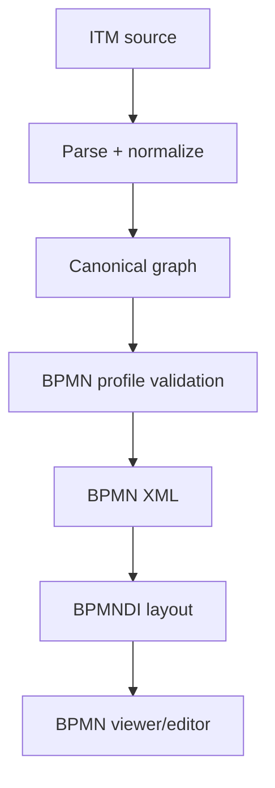

# BPMN 2.0 ITM Profile — Production Notes

## Scope

The `bpmn20-basic-profile.itm` file is a reusable ITM package for writing BPMN 2.0-style process models in the Indented Text Model format.

The profile targets the BPMN 2.0.2 formal OMG inventory while remaining usable under the simpler name “BPMN 2.0 profile”. BPMN 2.0 itself was superseded by later 2.0.x inventories, while BPMN 2.0.2 is the formal January 2014 version and has the normative PDF plus machine-readable CMOF/XSD artifacts.

The profile covers:

- core process elements;
- events and event definitions;
- tasks, subprocesses, call activities, and gateways;
- sequence flow and message flow;
- participants, lanes, collaborations, conversations, and choreography elements;
- data objects, data stores, data associations, resources, annotations, and groups;
- validation rules for production readiness;
- starter styles and viewpoints for graph rendering, BPMN XML export, BPMNDI export, visual editing, and validation reports.

## Design decisions

### 1. Treat ITM as the canonical source, not generated BPMN XML

The ITM model remains the editable source. BPMN XML is a projection produced by a pipeline.

Recommended flow:



### 2. Require explicit BPMN edges for production

Sibling order may be useful while drafting, but it is not enough for reliable BPMN export. Production BPMN should use explicit relationships such as:

```itm
@bpmn::sequenceFlow:target_id
@bpmn::messageFlow:target_id
@bpmn::dataInputAssociation:target_id
@bpmn::dataOutputAssociation:target_id
```

Sequence flow inferred from indentation or sibling order should produce warnings unless the model explicitly opts in to inference.

### 3. Keep containment separate from flow

Indentation may mean editorial grouping, process containment, lane containment, or subprocess containment. It must not silently become `sequenceFlow`.

The profile therefore treats hierarchy as structural/editorial until a validation or export plugin confirms that a specific parent-child relationship is allowed as BPMN containment.

### 4. Use attributes for BPMN XML fields

BPMN has many reference and expression attributes. In ITM, simple cases can be represented as YAML-compatible node or edge attributes:

```itm
&send_invoice [bpmn::SendTask] Send invoice
{
  owner: finance
  messageRef: invoice_message
  operationRef: billing_operation
}

@bpmn::sequenceFlow:approved_end
{
  id: flow_decision_approved
  conditionExpression: "approved = true"
}
```

### 5. Preserve round-trip data explicitly

For BPMN imported from external tools, use a round-trip/provenance profile such as:

```yaml
prov::sourceFormat: BPMN
prov::sourceId: Task_123
prov::sourcePath: /definitions/process[1]/task[3]
prov::mappingConfidence: high
```

Unknown extension elements should be preserved in a namespaced attribute or companion structure rather than dropped.

## Required runtime extensions

The profile is descriptive until these runtime capabilities exist.

### `itm.core`

Required capabilities:

- parse ITM indentation, ids, types, attributes, descriptions, directives, and typed links;
- normalize tabs to two spaces or reject invalid indentation;
- resolve `::` namespace-qualified names and `:` typed-link delimiters;
- collect diagnostics.

### `itm.type-hierarchy`

Needed because many validation rules select abstract classes such as `bpmn::FlowNode`, `bpmn::Event`, `bpmn::Activity`, or `bpmn::InteractionNode`.

Required capabilities:

- load `%entitytype` declarations;
- resolve `extends` chains;
- expand selectors over subtypes;
- reject direct use of abstract types where concrete BPMN XML is required.

### `itm.relationship-identity`

Needed because BPMN XML elements such as `sequenceFlow`, `messageFlow`, `association`, and data associations need stable ids.

Required capabilities:

- read explicit relationship `id` attributes;
- derive deterministic ids when allowed;
- detect duplicate relationship ids;
- preserve edge ids during round-trip.

### `itm.graph-model`

Needed to avoid direct text-to-XML mapping.

Required canonical graph shape:

```yaml
nodes:
  - id
  - type
  - label
  - attributes
  - description
  - sourceLocation
relationships:
  - id
  - type
  - source
  - target
  - attributes
  - sourceLocation
views:
  - id
  - viewpoint
  - deltas
```

### `bpmn.rules`

This is the main production validation engine.

It should implement at least:

- sequence flow source/target checks;
- same-process/subprocess scope validation;
- rejection of sequence flow across pools;
- message flow collaboration checks;
- start/end/boundary event constraints;
- event definition compatibility;
- gateway condition/default-flow checks;
- lane membership checks;
- participant/process reference validation;
- data association endpoint checks;
- call activity and callable element checks;
- choreography participant checks;
- conversation link checks;
- export readiness checks.

### `bpmn.xml`

Required for BPMN XML generation and import.

Export pipeline responsibilities:

1. create `bpmn:definitions`;
2. emit root elements such as `process`, `collaboration`, `message`, `itemDefinition`, and `signal`;
3. emit flow elements inside the correct owner scope;
4. emit sequence/message/data/association edges as BPMN XML elements;
5. map ITM descriptions to BPMN `documentation`;
6. map ITM labels to BPMN `name`;
7. preserve unknown extension elements where possible;
8. validate against the BPMN XSD.

Import pipeline responsibilities:

1. parse BPMN XML;
2. create ITM nodes with `&id [bpmn::Type] label`;
3. convert XML references into typed ITM edges;
4. preserve documentation as `|` Markdown description blocks;
5. preserve BPMNDI as `%view` deltas or `layout::` attributes;
6. preserve unknown extension elements as round-trip metadata.

### `bpmn.di`

Needed for visual tools such as BPMN viewers/editors.

Required capabilities:

- read and write BPMNDI shapes and edges;
- map bounds to `layout::x`, `layout::y`, `layout::w`, `layout::h` or `%view` deltas;
- generate layout when no layout is present;
- distinguish model-level semantic changes from view-level layout changes.

### `bpmn.editor` / visual editor integration

For integration with tools such as bpmn-js, use safe edit mode:

1. freeze the ITM source while the visual editor is in edit mode;
2. transform ITM to BPMN XML + BPMNDI;
3. allow visual editing;
4. compute a write-back patch;
5. classify edits as semantic changes or view/layout deltas;
6. show diagnostics and patch preview;
7. apply or discard the patch.

## Minimum production pipeline

A minimal production pipeline should implement:

```yaml
pipeline:
  - parse: itm.core
  - resolve: itm.namespaces
  - resolve: itm.includes
  - resolve: itm.packages
  - build: itm.graph-model
  - validate: bpmn.rules.basicProcessWellFormedness
  - transform: bpmn.xml
  - validate: bpmn.xml.schema
  - export: file.bpmn
```

For visual production output, add:

```yaml
  - layout: bpmn.di.applyOrGenerate
  - validate: bpmn.di.wellFormedness
  - render: bpmn.viewer
```

For round-trip import, use:

```yaml
pipeline:
  - import: bpmn.xml
  - import: bpmn.di
  - transform: itm.graph-model
  - transform: itm.source
  - validate: bpmn.rules.roundTripPreservation
```

## Practical subset for the first implementation

Start with:

- `Definitions`;
- `Process`;
- `StartEvent`, `IntermediateCatchEvent`, `IntermediateThrowEvent`, `EndEvent`, `BoundaryEvent`;
- `Task`, `UserTask`, `ServiceTask`, `SendTask`, `ReceiveTask`, `SubProcess`, `CallActivity`;
- `ExclusiveGateway`, `ParallelGateway`, `InclusiveGateway`, `EventBasedGateway`;
- `SequenceFlow`;
- `Participant`, `Lane`, `Collaboration`, `MessageFlow`;
- `DataObjectReference`, `DataStoreReference`, `DataInputAssociation`, `DataOutputAssociation`;
- `TextAnnotation`, `Association`;
- BPMNDI shape and edge bounds.

Defer full support for:

- choreography;
- conversation diagrams;
- transaction compensation details;
- complex gateway activation semantics;
- full executable BPMN semantics;
- vendor extension round-trip beyond preservation.

## Definition of done

The profile is production-ready when:

- every BPMN XML export validates against the BPMN XSD;
- sequence flows cannot cross participant boundaries;
- message flows require collaboration context;
- start/end/boundary event constraints are enforced;
- gateway warnings are emitted for missing conditions/defaults;
- BPMNDI is either preserved or generated deterministically;
- imports preserve unknown extension elements or report explicit loss diagnostics;
- all semantic inference produces diagnostics with confidence levels;
- golden-file round-trip tests exist for process, collaboration, lane, data, boundary event, and gateway examples.
